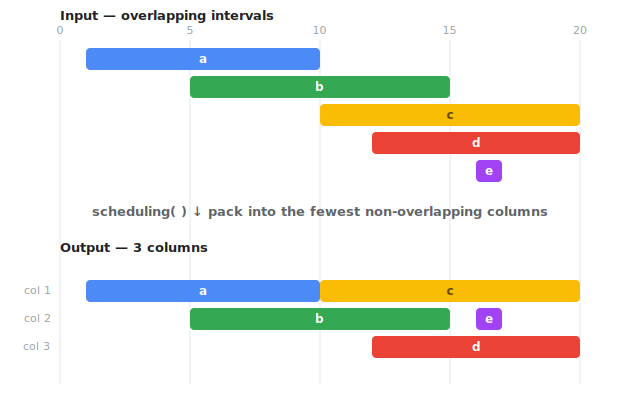
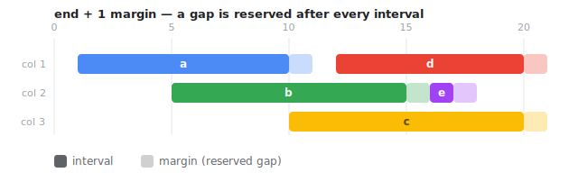

# interval-scheduling

[](https://github.com/elzup/interval-scheduling/actions/workflows/node.yml)

Efficient interval scheduling and optimization algorithms with TypeScript support. Calculate row grouping for Gantt charts and solve interval scheduling problems.

## Installation

```bash
npm install interval-scheduling
```

## Features

- **Interval Scheduling**: Efficiently place non-overlapping intervals in multiple columns
- **Multiple Strategies**: Choose from greedy, optimized, and balanced algorithms
- **Type Safety**: Full TypeScript support with strict typing
- **High Performance**: O(n log n) time complexity
- **Flexibility**: Custom object transformation capabilities

## Basic Usage

```js
import { scheduling } from 'interval-scheduling'

const items = [
  { id: 'a', start: 1, end: 10 },
  { id: 'b', start: 5, end: 15 },
  { id: 'c', start: 10, end: 20 },
  { id: 'd', start: 12, end: 20 },
  { id: 'e', start: 16, end: 17 },
]

const result = scheduling(items)
console.log(result)
// [['a', 'c'], ['b', 'e'], ['d']]
```

### How it works

`scheduling` packs overlapping intervals into the fewest non-overlapping columns:



<details>
<summary>ASCII version</summary>

```
   |          111111111122
   |0123456789012345678901
  a| +--------<
  b|     +---------<
  c|          +---------<
  d|            +-------<
  e|                +<
↓scheduling↓
   |          111111111122
   |0123456789012345678901
a,c|+---------+---------<
b,e|     +---------<+<
  d|            +-------<
```

</details>

### Adding Gaps (Margins)

If you need gaps between intervals, add margin to the end:

```js
const itemsWithGaps = items.map((v) => ({ ...v, end: v.end + 1 }))
const result = scheduling(itemsWithGaps)
console.log(result)
// [['a', 'd'], ['b', 'e'], ['c']]
```



<details>
<summary>ASCII version</summary>

```
   |          111111111122
   |0123456789012345678901
a,d|+--------.< +-------.<
b,e|     +---------.+.<
  c|          +---------.<
```

</details>

## Advanced Usage

### Working with Custom Objects

```js
import { schedulingBy } from 'interval-scheduling'

const meetings = [
  {
    title: 'Morning Standup',
    startTime: new Date('2024-01-01T09:00'),
    endTime: new Date('2024-01-01T09:30'),
  },
  {
    title: 'Planning Meeting',
    startTime: new Date('2024-01-01T09:15'),
    endTime: new Date('2024-01-01T10:15'),
  },
]

const result = schedulingBy(meetings, (meeting) => ({
  id: meeting.title,
  start: meeting.startTime.getTime(),
  end: meeting.endTime.getTime(),
}))
```

### Optimized Scheduling

Use `schedulingEase` for optimized column allocation:

```js
import { schedulingEase } from 'interval-scheduling'

const optimizedResult = schedulingEase(items)
console.log(optimizedResult)
// Attempts to minimize the number of columns used
```

## New API (v2)

The package also provides a new API with additional metadata:

```js
import { schedule, scheduleOptimized } from 'interval-scheduling'

const result = schedule(items, { strategy: 'greedy' })
console.log(result)
// {
//   columns: [['a', 'c'], ['b', 'e'], ['d']],
//   totalColumns: 3,
//   efficiency: 0.67,
//   metadata: {
//     strategy: 'greedy',
//     processingTime: 1.2,
//     inputSize: 5
//   }
// }
```

## API Reference

### Core Functions

#### `scheduling(items, options?)`

Greedy interval scheduling. Sorts by start, then assigns each interval to the
column whose current end is earliest (via a min-heap), opening a new column only
when none is free. The resulting column count is the minimum possible.

**Complexity:** `O(n log n)` time, `O(n)` space — independent of how much the
intervals overlap.

**Parameters:**

- `items: ScheduleItem[]` - Array of items with `id`, `start`, and `end` properties
- `options?: SchedulingOptions` - Optional configuration

**Returns:** `T[][]` - Array of columns, each containing item IDs

#### `schedulingBy(items, mapper, options?)`

Schedule custom objects by providing a transformation function.

**Parameters:**

- `items: T[]` - Array of original objects
- `mapper: (item: T) => ScheduleItem` - Function to transform objects
- `options?: SchedulingOptions` - Optional configuration

**Returns:** `T[][]` - Array of columns with original objects

#### `schedulingEase(items)`

Balanced (round-robin) packing. Distributes intervals across columns in a
round-robin fashion, trying the smallest feasible column count first. The lower
bound (peak simultaneous overlap) is computed up front so infeasible attempts
are skipped.

**Complexity:** `O(n log n + n · C)` time, where `C` is the number of columns.
For typical inputs (small `C`) this is effectively `O(n log n)`, but it grows
heavier as overlap — and therefore `C` — increases. Prefer `scheduling` for
large, highly-overlapping inputs.

**Parameters:**

- `items: ScheduleItem[]` - Array of items to schedule

**Returns:** `T[][]` - Balanced column arrangement

### New API Functions

#### `schedule(items, options?)`

Enhanced scheduling with metadata.

**Returns:** `SchedulingResult<T>` - Detailed result object

#### `scheduleOptimized(items, options?)`

Alias for optimized scheduling strategy.

#### `scheduleBalanced(items, options?)`

Balanced scheduling strategy (future implementation).

### Types

```typescript
interface ScheduleItem<T = unknown, K = number> {
  readonly id: T
  readonly start: K
  readonly end: K
}

interface SchedulingResult<T> {
  readonly columns: ReadonlyArray<ReadonlyArray<T>>
  readonly totalColumns: number
  readonly efficiency: number
  readonly metadata: {
    readonly strategy: string
    readonly processingTime: number
    readonly inputSize: number
  }
}

interface SchedulingOptions {
  readonly strategy?: 'greedy' | 'optimized' | 'balanced'
  readonly maxColumns?: number
  readonly allowOverlap?: boolean
  readonly sortBy?: 'start' | 'end' | 'duration'
}
```

## Performance

`scheduling` runs in `O(n log n)` regardless of overlap. Measured best-of-5 on
an M-series laptop (`npm run build && npm run benchmark`):

| Data Size     | `scheduling` (staggered) | `scheduling` (fully overlapping) |
| ------------- | ------------------------ | -------------------------------- |
| 1,000 items   | ~0.2 ms                  | ~0.04 ms                         |
| 10,000 items  | ~0.3 ms                  | ~0.4 ms                          |
| 100,000 items | ~4 ms                    | ~7 ms                            |

`schedulingEase` is heavier because round-robin packing is not optimal: cost
scales with the column count `C`. It stays fast when `C` is small (staggered
intervals: ~22 ms for 100,000 items) but slows down on highly-overlapping inputs
(hundreds of overlapping columns). Use `scheduling` when throughput matters.

## Use Cases

- **Meeting Room Scheduling**: Allocate meeting rooms efficiently
- **Resource Management**: Optimize resource allocation over time
- **Gantt Chart Rendering**: Calculate row positions for timeline visualizations
- **Task Scheduling**: Organize overlapping tasks into parallel tracks
- **Event Planning**: Manage concurrent events and venues

## License

MIT

## Contributing

Contributions are welcome! Please feel free to submit a Pull Request.
